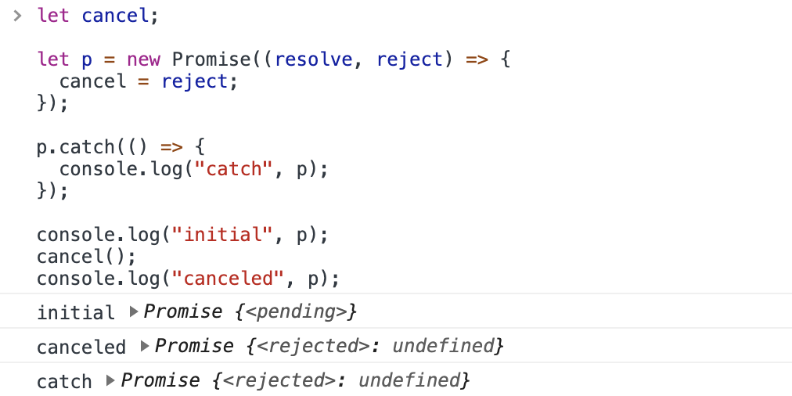
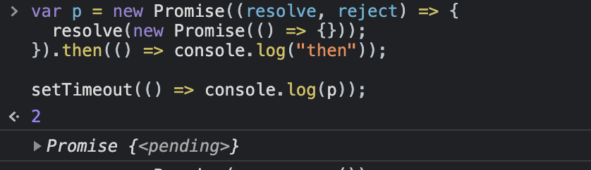
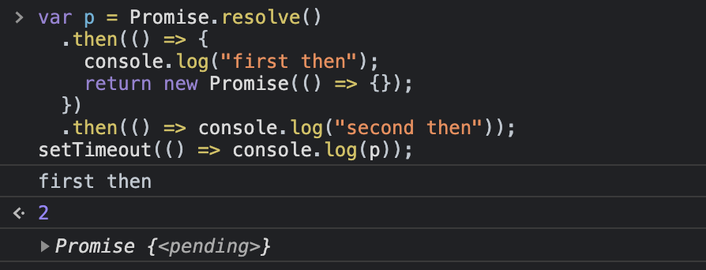

没想到吧，promise 流程的控制竟然如此简单

<!-- more -->

> _方便起见，本文中的 then 默认指接受第一个回调函数的情况_

## Promise 状态


Promise 的状态只有两个转变路径，并且状态发生变更后就不可更改：

1. `pending -> fulfilled`
2. `pending -> rejected`

这 3 个状态是内部状态。

## Promise 生命过程

**1. 创建**

```js
const p = new Promise((resolve, reject) => {
  if (success) {
    resolve()
  }

  reject()
})
```

1. 执行构造函数，将返回的 promise 赋值给 p，p 的状态为 pending
2. 执行器函数**接收 resolve、resject 函数**，用来将 p 的状态变为 fulfilled 或者 rejected

   **这两个函数可以在函数外部执行**

**2. 状态变更**

```js
p.then(() => {}).catch(() => {})
```

1. 当 p 的状态从 pending 变更为 fulfilled 的时候，触发 then 传入的回调
2. 当 p 的状态从 pending 变更为 rejected 的时候，触发 catch 传入的回调



上面代码中，外部执行的 cancel() 将 p 的状态变更为 rejected，然后触发 p.catch() 中传入的回调函数

## 可取消（cancellation）

**原理：**
通过构造函数创建的 Promise，在状态变化之前，强制变更状态为 rejected。从而不触发 .then 传入的回调

利用上面的能力，我们很容易就写出来可以被取消的 Promise 包装函数：

```js
class CancelError extends Error {}

function cancellable(p) {
  let cancel

  let promise = new Promise((resolve, reject) => {
    p.then(resolve, reject)
    cancel = () => reject(new CancelError())
  })

  return { promise, cancel }
}
```

<details>
  <summary>点开看测试用例</summary>

```js
/**
 * test case
 */
var p = new Promise(resolve => setTimeout(resolve, 1000))
const { promise, cancel } = cancellable(p)

promise
  .then(() => console.log('then1'))
  .then(() => console.log('then2'))
  .catch(err => {
    console.log('catch')
    console.log('is canceled:', err instanceof CancelError)
  })
  .then(() => console.log('then3'))

cancel()

// --- 打印结果 ---
// catch
// is canceled: true
// then3
```

</details>

当然，我们也可以结合 Promise.race 实现该效果：

```js
class CancelError extends Error {}

function cancellable(P) {
  let cancel
  const promise = Promise.race([
    p,
    new Promise((_, reject) => {
      cancel = () => reject(new CancelError())
    }),
  ])

  return { promise, cancel }
}
```

第一种只创建了一个 promise，比第二个方法创建了两个 promise 的开销小一点。

## 可中断（break the chain）

**原理：**
通过返回一个 pending 的并且不会发生状态变化的 promise，中断后续执行


<br>
<br>


利用这个技巧可以改写上面的 cancellable 函数：

```js
function interruptible(p) {
  let interrupt
  let interrupted = false

  let promise = new Promise((resolve, reject) => {
    p.then(resolve, reject)
    interrupt = () => {
      interrupted = true
      reject()
    }
  }).then(
    res => (interrupted ? new Promise(() => {}) : res),
    err => {
      if (interrupted) {
        return new Promise(() => {})
      } else {
        throw err
      }
    }
  )

  return { promise, interrupt }
}
```

<details>
  <summary>点开看测试用例</summary>

```js
/**
 * test 1
 */
var { promise, interrupt } = interruptible(new Promise(resolve => setTimeout(resolve)))
promise.then(() => console.log(11))
var p = promise.then(() => console.log(22)).catch(() => console.log(33))
p.then(() => console.log(33))
interrupt()

// --- 没有打印 ---

/**
 * test 2
 */
interruptible(
  new Promise(resolve => {
    setTimeout(resolve)
  })
).promise.then(() => console.log('then'))

// --- 打印 ---
// then: then result

/**
 * test 3
 */
interruptible(
  new Promise((_, reject) => {
    setTimeout(reject)
  })
).promise.catch(() => console.log('catch'))
// --- 打印 ---
// catch
```

</details>

<br>
<br>
<br>

参考文章：

1. https://github.com/domenic/promises-unwrapping/blob/master/docs/states-and-fates.md
2. https://developer.mozilla.org/zh-CN/docs/Web/JavaScript/Reference/Global_Objects/Promise
3. https://gist.github.com/QuarkGluonPlasma/d0d774bd544006c1194c8547bdafc6ba
